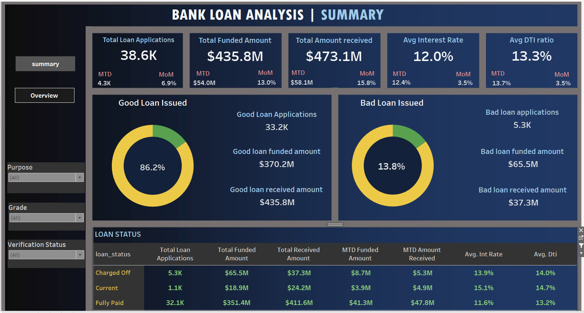
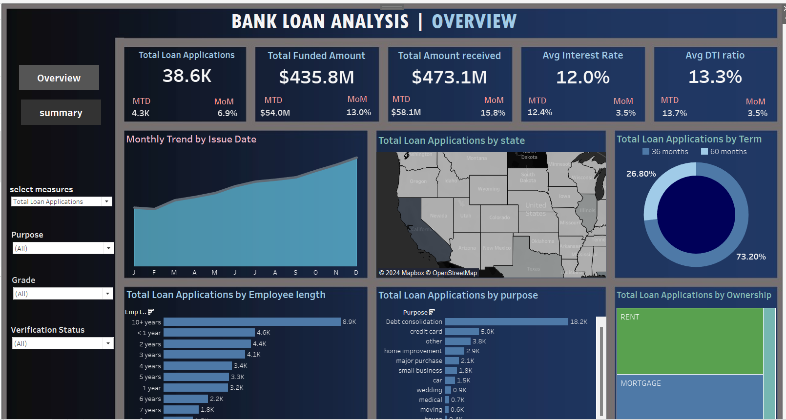

# Bank Loan Analysis Project

## Project Overview
This project aims to analyze bank loan data using SQL and Tableau to uncover trends, performance metrics, and insights that can be valuable for understanding the loan application process, repayment behavior, and loan statuses. The analysis is focused on:

* Loan Applications: Total, month-over-month (MoM) trends.
* Funded Amounts: Total amounts funded and repaid.
* Loan Statuses: Good vs. bad loans.
* Regional and Purpose-Based Analysis: Loan distribution across regions and purposes.
The project utilizes SQL for querying the data and Tableau for visualizations, helping to provide a clearer understanding of the data.

**Data Overview**
The dataset includes various fields related to bank loan applications. Key fields are:

``id``: Unique identifier for each loan application.

``address_state``: State of the applicant.

``application_type``: Type of loan application.

``emp_length``: Employment length of the applicant.

``emp_title``: Job title of the applicant.

``grade & sub_grade``: Risk grades assigned to the applicant.

``home_ownership``: Applicant's home ownership status.

``issue_date``: Date the loan was issued.

``loan_status``: Status of the loan (e.g., fully paid, charged off, current).

``loan_amount``: Amount of the loan.

``int_rate``: Interest rate of the loan.

``dti``: Debt-to-income ratio.

``purpose``: Purpose of the loan (e.g., debt consolidation, home improvement).

``total_payment``: Total payment made towards the loan.

## Tableau Visualizations
To complement the SQL analysis, Tableau was used to create visual dashboards that provide a clear representation of the data insights. Below are some of the key visualizations.

**1. Loan Status Breakdown**
This dashboard showcases the total number of applications, funded amounts, and received amounts, categorized by loan status.

**2. Regional Loan Analysis**
This visualization represents the distribution of loan applications and funded amounts across different states.

**3. Loan Purpose Breakdown**
This chart illustrates the number of loan applications for each loan purpose, providing insights into the most common reasons for loan applications.

**4. Month-over-Month Loan Applications**
This graph tracks the month-over-month trend of loan applications, helping identify periods of high and low activity.

**Key Insights**
* Month-over-Month Growth: The data shows clear fluctuations in loan applications and funded amounts month over month.
* Good vs. Bad Loans: A significant percentage of loans are either fully paid or current, but a noticeable percentage of loans have been charged off, representing bad loans.
* Regional Disparities: Certain states show higher loan application rates, which could indicate economic trends or regional financial needs.
* Loan Purposes: Debt consolidation is a common loan purpose, followed by home improvement, indicating where financial assistance is most sought after.

## Conclusion
This analysis provided valuable insights into bank loan behaviors and trends, offering a deeper understanding of loan application volumes, regional trends, loan purpose breakdowns, and loan statuses. SQL was used for the core analysis, while Tableau was leveraged to create interactive visualizations.

